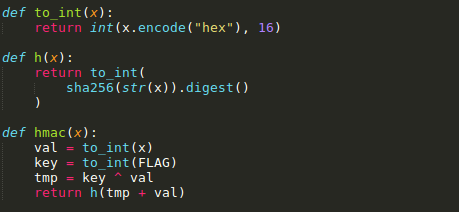

# Hm4c
  
**Challenge Points**: 50  
  
**Challenge Description**: Some n00b implemented a HMAC, I'm sure you can pwn it  
  
We are given [hm4c.py](hm4c.py) running on `crypto.midnightsunctf.se` and port number `31337`. The script basically generates a custom HMAC of `FLAG` + (`input` that we give to it). This is how the HMAC is generated:  
  
As we can see, the server returns the SHA256 hash of `(FLAG ^ input) + input`. This is what makes this challenge vulnerable to Bit by Bit Decryption, let us see how:  
1. To get the SHA256 of FLAG we just send base64 encoded string of `\x00` as the output will be SHA256((FLAG ^ 0) + 0) = SHA256(FLAG)
2. Starting from LSB, we analyse the value returned by the function when the last bit of our input is **1**
   - If the last bit of FLAG is 1 then the last bit of `(FLAG ^ input) + input` will be `(1 ^ 1) + 1 = 0 + 1 = 1` which is the same as the last bit of the FLAG and hence the HMAC won't change.
   - If the last bit of FLAG is not 1, then the last bit of `(FLAG ^ input) + input` will be `(0 ^ 1) + 1 = 10`; although the last bit is same here again, but notice that one bit of just before the last bit has changed and hence the HMAC will change.
3. Now, we can use the same concept to get every bit of FLAG as follows:
   - Send 1, 2, 4, 8, ..., 2**`i` as an input and check if the the output for each input matches with the SHA256 of FLAG obtained in Step-1.
     - If it matches, then the `i`th bit of FLAG is 1, otherwise it is 0
  
  

I wrote the following python implementation of the exploit:  
```python
flag = ""
r = process("./hm4c.sh")
r.recvline().replace("\n","")
for i in range(256):
	r.recvline().replace("\n","")
	r.recvline().replace("\n","")
	r.recvline().replace("\n","")
	r.sendline("1")
	r.recvline().replace("\n","")

	r.sendline(int_to_base64(1<<i))
	recvd = r.recvline().replace("\n","")
	if int(recvd) == base_hash:
		flag += "1"
	else:
		flag += "0"

flag = flag[::-1]
print "[+] Got the flag: ", long_to_bytes(int(flag,2))
```
Check out the entire exploit script [here](exploit.py)  

