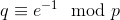
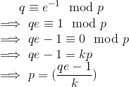
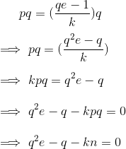
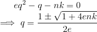
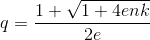

# Revolutionary Secure Angou

**Challenge Points**:  
  
**Challenge Description**: [No Description]

In this challenge, we are given an encryption script written in ruby that encrypts the flag using RSA. We are also given the [public key](publickey.pem) and [ciphertext](flag.encrypted). Let us analyse the encryption script first:  

```ruby
require 'openssl'

e = 65537
while true
  p = OpenSSL::BN.generate_prime(1024, false)
  q = OpenSSL::BN.new(e).mod_inverse(p)
  next unless q.prime?
  key = OpenSSL::PKey::RSA.new
  key.set_key(p.to_i * q.to_i, e, nil)
  File.write('publickey.pem', key.to_pem)
  File.binwrite('flag.encrypted', key.public_encrypt(File.binread('flag')))
  break
end
```
As you can see, private key parameters are not generated as they are supposed to be. Specifically, although `p` is a pseudo-random prime generated using OpenSSL, but `q` is generated as . Looks fishy! Also, there are no other suspicious lines of code as everything else looks fine. So now we know where we have to focus to find the exploit!  
  
We want to find someway to get the value of `p`, and we can use the equation for `q` to get this. Let us see how:  
  
In the above equation, `k` is the multiplier. Now, if we multiply the above equation with `q` on both sides, we will have:  
  
We know that n = p*q, hence the simplification above.  
  
Great, now we have a simple quadratic equation, to get the value of `q`, knowing the value of `e` and `n`. Although, we don't know the value of `k`, we can brute-force the value of `k`. To solve the above quadratic equation:  
  
So as per the above formula, there are two possible values of `q`; but we can remove the negative sign since `q` is very large and cannot be less than one. This gives us:  
  
  
To get the value of `q`, iterate check for every value of `k`, if  is a perfect square. If it does, then we have got the value of `q`! I implemented this using the following script:  
```python
for k in range(1, 1000000):
        # Checking for perfect equare
	if gmpy2.iroot(1+4*e*n*k, 2)[1] == True:
                # Calculating q
		q = (1 + int(gmpy2.iroot(1+4*e*n*k, 2)[0]))/(2*e)
		if n % q == 0:
			factor = q
			print k
			break
```
This gave me the value of `q` as: 117776309990537864360810812340917258096636219871129327152749744175094693075913995854147376703562090249517854407162616412941789644355136574651545193852293544566513866746012759544621873312628262933928953504305148673201262843795559879423287920215664535429854303448257904097546288383796049755601625835244054479553  
  
Now that we have `q`, we can calculate `p` and hence the private key to get the flag:  
```python
from Crypto.PublicKey import RSA
from Crypto.Util.number import *
import gmpy2

key = RSA.importKey(open("publickey.pem").read())
n = key.n
e = key.e
print n
print e

for k in range(1, 1000000):
	if gmpy2.iroot(1+4*e*n*k, 2)[1] == True:
		q = (1 + int(gmpy2.iroot(1+4*e*n*k, 2)[0]))/(2*e)
		if n % q == 0:
			factor = q
			print k
			print "q: ", q
			break
ct = open("flag.encrypted").read()
ct = bytes_to_long(ct)
p = n/factor
phin = (p-1)*(q-1)
d = inverse(e, phin)
print long_to_bytes(pow(ct, d, n))
```
  
Ran the above script and got the flag as: **TWCTF{9c10a83c122a9adfe6586f498655016d3267f195}** !
  
You can check out the exploit script here- [exploit.py](exploit.py)  