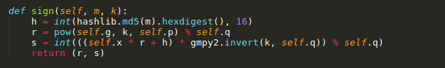
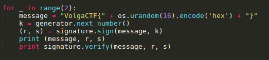
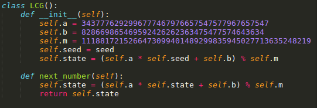
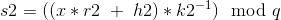
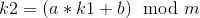
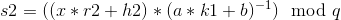
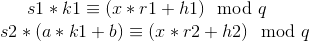
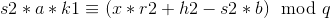
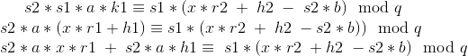
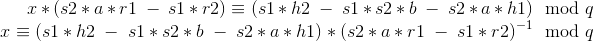

# Nonsense
  
**Challenge Points**: 200  
**Challenge Description**: We've intercepted several consecutive signatures. Take everything you need and find the secret key. Send it to us in hex.  
  
We are given [task.py](task.py) as the script used to sign data.  
Following are the public parameters: `g`, `y`, `p`, `q`, `a`, `b`, `m`, `message`
  
Following is the code for signing data:  
  
Particularly, the above function has a vulnerability: `k` is being generated using LCG when it is supposed to be generated using a secure algorithm. This is how two values of `k` are being used to sign different messages:  
  
And the LCG:  
  
  
## The Exploit
Since we have signatures of two messages whose nonces (ie. `k`) are generated using LCG, we can write:  
  
  
We know from LCG that  
  
Note that values of `m` and `q` are the same, we can then write s2 as:  
  
Multiplying both sides by their respective `k`, we have:  
  
  
Multiplying the above equation with s1, we have:  
  
Arranging the terms we get `x` as:  
  
  
I wrote the following script [exploit.py](exploit.py) to implement the above exploit:  
```python
import hashlib
from Crypto.Util.number import *

# Signature function body variables
g = 88125476599184486094790650278890368754888757655708027167453919435240304366395317529470831972495061725782138055221217302201589783769854366885231779596493602609634987052252863192229681106120745605931395095346012008056087730365567429009621913663891364224332141824100071928803984724198563312854816667719924760795
y = 18433140630820275907539488836516835408779542939919052226997023049612786224410259583219376467254099629677919271852380455772458762645735404211432242965871926570632297310903219184400775850110990886397212284518923292433738871549404880989194321082225561448101852260505727288411231941413212099434438610673556403084
p = 89884656743115795425395461605176038709311877189759878663122975144592708970495081723016152663257074178905267744494172937616748015651504839967430700901664125135185879852143653824715409554960402343311756382635207838848036159350785779959423221882215217326708017212309285537596191495074550701770862125817284985959
q = 1118817215266473099401489299835945027713635248219

# LCG parameters
a = 3437776292996777467976657547577967657547
b = 828669865469592426262363475477574643634
m = 1118817215266473099401489299835945027713635248219

assert m == q

msg1 = "VolgaCTF{nKpV/dmkBeQ0n9Mz0g9eGQ==}"
h1 = int(hashlib.md5(msg1).hexdigest(), 16)
msg2 = "VolgaCTF{KtetaQ4YT8PhTL3O4vsfDg==}"
h2 = int(hashlib.md5(msg2).hexdigest(), 16)

r1 = 1030409245884476193717141088285092765299686864672
r2 = 403903893160663712713225718481237860747338118174

s1 = 830067187231135666416948244755306407163838542785
s2 = 803753330562964683180744246754284061126230157465

inv1 = inverse(s2*a*r1 - s1*r2, q)
x = ((s1*h2 - s1*s2*b - s2*a*h1)*inv1) % q
print hex(x)[2:].replace("L","")
```
Got the secret key (in hex) as: **9d529e2da84117fe72a1770a79cec6ece4065212**