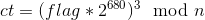
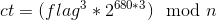
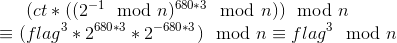

# Daring

**Challenge Points**:

**Challenge Description**: We encrypted our flag, but we lost the keys. Can you help?

This was a simple yet a very tricky challenge made by `yyyyyyy` aimed at testing your basics. In this challenge you are given a small script:

```python
#!/usr/bin/env python3
import os
from Crypto.Cipher import AES
from Crypto.Hash import SHA256
from Crypto.Util import Counter
from Crypto.PublicKey import RSA

flag = open('flag.txt', 'rb').read().strip()

key = RSA.generate(1024, e=3)
open('pubkey.txt', 'w').write(key.publickey().exportKey('PEM').decode() + '\n')
open('rsa.enc', 'wb').write(pow(int.from_bytes(flag.ljust(128, b'\0'), 'big'), key.e, key.n).to_bytes(128, 'big'))

key = SHA256.new(key.exportKey('DER')).digest()
open('aes.enc', 'wb').write(AES.new(key, AES.MODE_CTR, counter=Counter.new(128)).encrypt(flag))
```

If you analyse the script carefully, you will notice that the same flag is encrypted in two independent ways:
1. The flag is padded with `\x00` (null byte) to make the plaintext of size 128 bytes and then encrypted using the public key where `e = 3`
2. SHA256 of the private key of used for encryption using RSA is calculated, the result of which is then used as a symmetric key to encrypt the `unpadded` flag using AES in CTR mode.

Some observations:
1. We all know that `e = 3` is vulnerable to root attacks, but here in our challenge, since the flag is padded with null bytes to make it of size 128 bytes, the root attack won't work since `pt`^3 > `n` (`pt` is the padded plaintext and `n` is the RSA modulus) and hence will wrap around while calculating the ciphertext.
2. When some plaintext is encrypted in CTR mode, remember that the ciphertext size is exactly of the same size as plaintext, since CTR mode is similar to a stream cipher.

Based on the above observations, we will try to move ahead:
1. Size of ciphertext of AES encrypted flag is 43 bytes. This implies that the original size of the flag is 43 bytes.
2. From (1), we can say that:
   + plaintext = flag + '\x00'\*(128-43) = flag + '\x00'\*85
   + ciphertext 
   + ciphertext 

To get **flag<sup>3</sup> % n**, we can compute:  
  


and get the value of `x` = flag<sup>3</sup> % n


Probably **flag<sup>3</sup> > n**, since flag is of 43 bytes. But we can write:
1. x = flag<sup>3</sup> % n
2. flag<sup>3</sup> = x + k*n

So, now if we add multiples of `n` to `x` and check if the resultant value is a perfect cube, we can get the flag by taking the cube root. This part of the challenge is similar to Iowe challenge from CSAW CTF Qualifiers 2018: https://ctftime.org/task/6668

I wrote the following script to solve the challenge:  
```python
#!/usr/bin/env python3
import os
from Crypto.Cipher import AES
from Crypto.Hash import SHA256
from Crypto.Util import Counter
from Crypto.Util.number import *
from Crypto.PublicKey import RSA
import gmpy2

pubkey = RSA.importKey(open("pubkey.txt").read())
e = pubkey.e
n = pubkey.n
rsa_enc = int.from_bytes(open("rsa.enc","rb").read(), 'big')

assert GCD(2, n) == 1
# 680 * 3 = 2040
inv = pow(inverse(2, n), 2040, n)
aes_enc = open("aes.enc","rb").read()

# From here we get the size of the actual flag
assert len(aes_enc) == 43
print(int.from_bytes(b"aaaaaaaaaaaaaaaaaaaaaaaaaaaaaaaaaaaaaaaaaaa".ljust(128,b'\0'), 'big') == int.from_bytes(b"aaaaaaaaaaaaaaaaaaaaaaaaaaaaaaaaaaaaaaaaaaa", 'big') << 680)

rsa_enc = rsa_enc*inv % n
for i in range(1000):
    ans = gmpy2.iroot(rsa_enc + i*n, 3)[1]
    if ans == True:
        print("Gotit", i)
        pt = int(gmpy2.iroot(rsa_enc + i*n, 3)[0])
        print(pt.to_bytes(43, 'big'))
        break
```
Exploit script here: [exploit.py](exploit.py)
